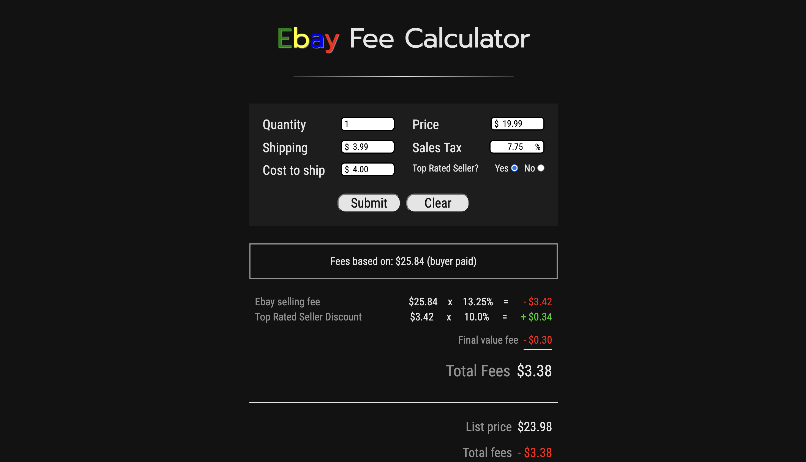

# Ebay Fee Calculator

## Description

Application allows Ebay seller to calculate seller fees and net profit. User submits listing data and then application displays all fees applied to the listing, as well as the net amount the seller makes after fees and shipping costs are applied.

## Usage:

This application is useful for predicting how much an Ebay seller will make from selling an item on the platform.

## Questions:

If you have any questions, you may contact me at either

- Github: https://github.com/dmilleza
  or
- Email: darrenmilleza@gmail.com

## <a href="https://dmilleza.github.io/Ebay-Fee-Calculator/">Link to application</a>
